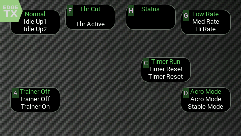

# EdgeTX_All_Switches_Widget

A dynamic, visual switch-state tracker for EdgeTX radios (like the TX16S). 

This widget displays the status of your switches using custom labels pulled from model-specific files, featuring a high-contrast design for maximum readability.

---



---
🚀 **Key Features**

🙈 **Intelligent Auto-Hide**

Keep your screen clean and clutter-free for simple models.

Dynamic Display: If a switch (like SD) has no label defined in your labels/*.lua file, the widget can automatically hide that box entirely.

Toggleable: You can turn this on or off in the Widget Settings menu on your radio.

🚦 **Active Position Highlighting**

Never guess which mode you are in.

The widget monitors the PWM value of each switch:

u (Up): -1024

m (Mid): 0

d (Down): +1024

The label for the current physical position will automatically change color to your Active Text Color (defaulting to your theme's focus color).

🛠️ **Configurable Refresh Rate**

Adjust how often the widget checks for switch movements (50ms to 1000ms).

Faster rates give you "instant" visual feedback, while slower rates save CPU cycles for complex flight controllers or telemetry scripts.


---


### **📂 Folder Structure**
To function correctly, the files must be placed on your SD card exactly as follows:
* `SD Card/WIDGETS/All_Switches/main.lua`
* `SD Card/WIDGETS/All_Switches/radio/TX16S.lua`
* `SD Card/WIDGETS/All_Switches/labels/global.lua`
* `SD Card/WIDGETS/All_Switches/labels/[MODEL_NAME].lua`

---

### **🛠️ Label Configuration**
The core of this widget is the labeling system. It looks for text in two places:
* **Global Labels:** Used for switches that do the same thing on every model (e.g., Arming or Turtle Mode).
* **Model Labels:** Used for specific model functions.

---

### **⚠️ Critical: Model Naming**
* The filename for your model labels must match the **Model Name** in your radio exactly, including spaces and capitalization. 
* **Example:** If your model is named `Mobula7`, the file must be `labels/Mobula7.lua`. 
* **Example:** If your model is named `Granite 4x4`, the file must be `labels/Granite 4x4.lua`.

---

### **🔡 Understanding the u, m, and d Logic**
When creating labels in your `.lua` files, you define the text for the three physical positions of a switch:  
* **u (Up):** Switch pushed away from you.
* **m (Middle):** Switch in the center position.
* **d (Down):** Switch pulled toward you.

**Example entry in `labels/global.lua`:**
```lua
return {
  ["SAu"] = "DISARMED",
  ["SAd"] = "ARMED",
  ["SBm"] = "STAB",
  ["SBd"] = "ACRO",
}
```
---

**🙏 Thank You**

Special thanks to @druckgott for the basis of this software: [getswitchesWdgets](https://github.com/druckgott/getswitchesWdgets). Their widget is great, but did not fit my needs as I wanted custom labels for each specific switch action.
